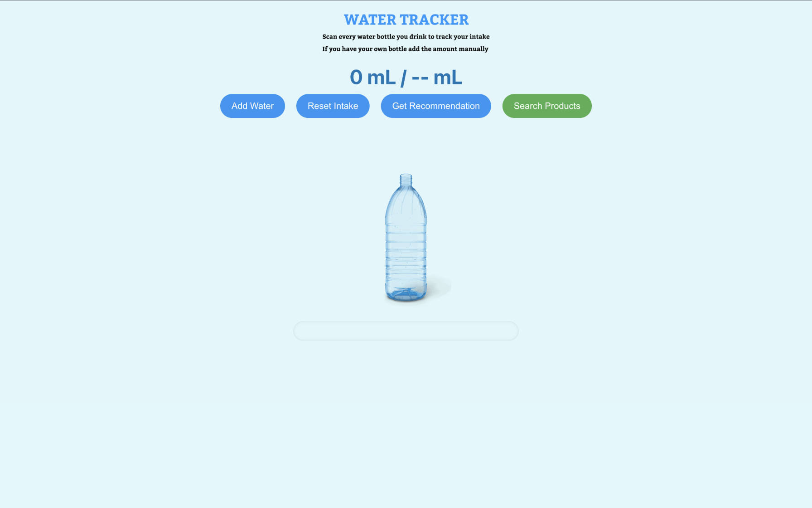
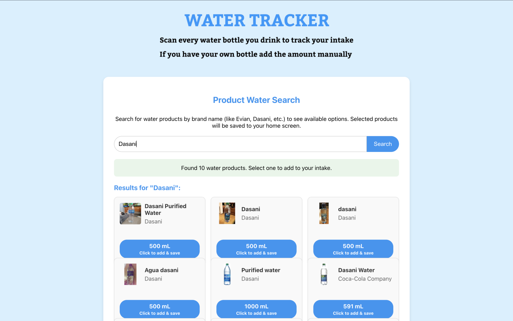
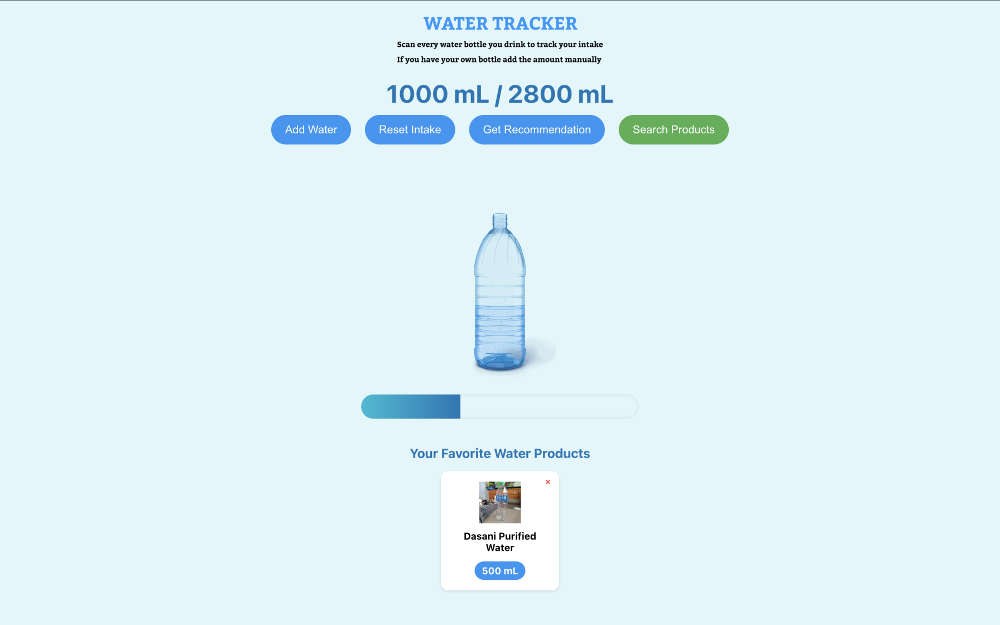
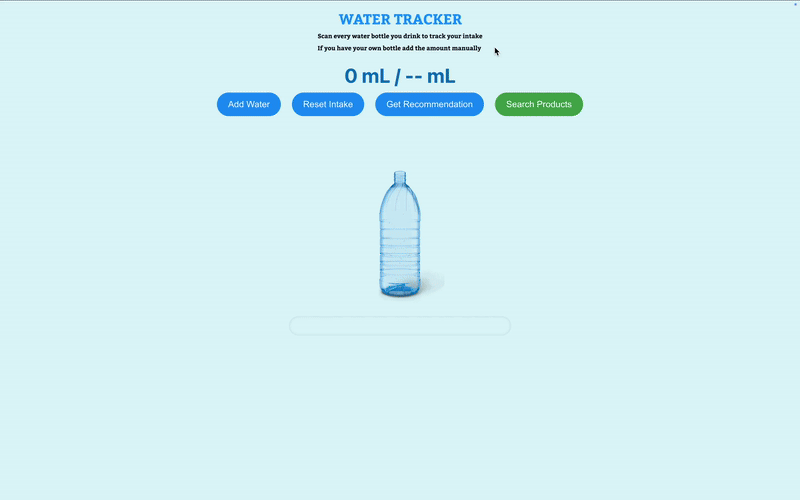

# Water Intake Tracker

## About
Water Intake Tracker app is used to track the amount of water the user consumes. It has features like giving recommendations based on user's height, weight, age, and gender. Another feature of the app includes a search functionality in which users can search for a brand of a water bottle and it gives results based on what the user searches. This search functionality goes through the open food facts api and displays the results based on the searches. When users select the water bottle it gets added to the total intake. Users can favorite certain water bottles, so that they can use it for later or they can just delete it if they dont want to. 

## How to Use This Project

### Using a Virtual Environment (Python Backend)

1. **Navigate to the backend folder**:
   ```bash
   cd backend
   ```

2. **Create a virtual environment**:
   ```bash
   python -m venv venv
   ```

3. **Activate the virtual environment**:
   - On macOS/Linux:
     ```bash
     source venv/bin/activate
     ```
   - On Windows:
     ```bash
     venv\Scripts\activate
     ```

4. **Install required backend dependencies**:
   ```bash
   pip install -r requirements.txt
   ```

5. **Run the backend server**:
   ```bash
   python app.py
   ```

### Frontend Setup

1. **Open a new terminal and navigate to the frontend folder**:
   ```bash
   cd frontend
   ```

2. **Install frontend dependencies**:
   ```bash
   npm install
   ```
   
   ```bash
   npm install react-router-dom
   ```

3. **Start the frontend server**:
   ```bash
   npm start
   ```

### Setting Up the Environment Variables (Backend)

- Install `python-dotenv`:
  ```bash
  pip install python-dotenv
  ```

- Create a `.env` file in the backend root:
  ```bash
  touch .env
  ```

- Add your OpenAI API key to `.env`:
  ```env
  KEY=your_api_key_here
  ```


---

## Demo

**Landing Page**:  
Users are greeted with a landing page.


**Get Recommendation**:  
Users input their body stats and get a recommended daily water intake goal. They can add water manually or search for products.


**Favorites**:  
Users automatically recieve favorite water products for quick reuse, visible under the progress bar.


**GIF Demo**

---
